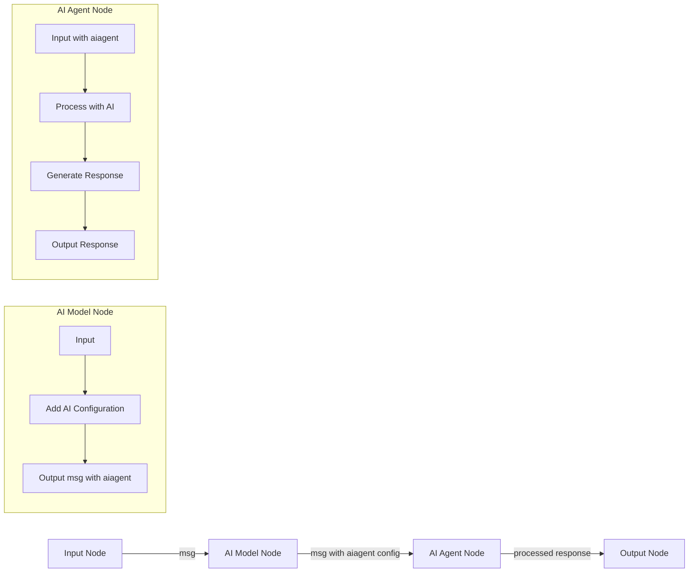

# Node-RED AI Agent Overview

## Message Flow: Model Node to Agent Node



## Detailed Message Flow

1. **Input Message**
   - Any Node-RED node sends a standard message to the **AI Model** node
   - The message can contain any payload (text, object, etc.)

2. **AI Model Processing**
   - The AI Model node adds an `aiagent` property to the message containing:
     ```javascript
     {
         model: "openai/gpt-3.5-turbo",  // or other configured model
         apiKey: "your-api-key",         // securely stored
         temperature: 0.7,               // creativity setting
         maxTokens: 1000                 // response length limit
     }
     ```
   - The original message payload remains unchanged

3. **AI Agent Processing**
   - Receives the enhanced message with `msg.aiagent` configuration
   - Uses the specified AI model and settings to process the input
   - Can maintain conversation context if configured
   - Generates a response based on the agent type (assistant, chatbot, etc.)

4. **Output**
   - Returns the AI's response in the message payload
   - Format depends on the agent's configuration (text or structured object)
   - Original message properties are preserved unless modified

## Example Flow

```
[inject] --> [AI Model] --> [AI Agent] --> [debug]
```

In this flow:
1. The inject node triggers the flow
2. AI Model adds configuration to the message
3. AI Agent processes the message using the specified AI model
4. Debug node displays the AI's response

## Error Handling

### Missing AI Configuration
If the AI Agent node receives a message without the required `aiagent` configuration, it will:
- Set the node status to show an error
- Log an error message
- Stop processing and pass the error to the catch node (if connected)
- The error message will be: "Missing required AI configuration. Ensure an AI Model node is properly connected and configured."

### Common Issues
1. **Missing AI Model Node**: Ensure an AI Model node is connected to the AI Agent node
2. **Invalid Configuration**: Verify that the AI Model node has all required fields (model, API key)
3. **API Connection Issues**: Check network connectivity and API key validity

## Configuration Tips

- **AI Model Node**: Configure your preferred model and settings
- **AI Agent Node**: Set the agent type and response format
- **Error Handling**: Always include a catch node to handle potential errors

For more detailed configuration options, see the [README](../README.md).